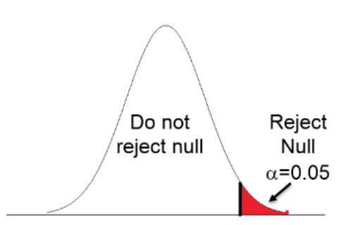
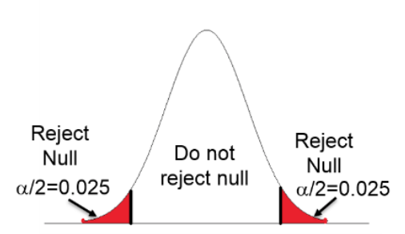

```{r setup, include=FALSE, message = FALSE, warning = FALSE}
knitr::opts_chunk$set(echo = F,
                      include=TRUE,
                      prompt = TRUE,
                      message = FALSE,
                      warning = FALSE,
                      fig.height = 5,
                      fig.width = 7,
                      cache = FALSE)
```

## **Multiple Regression Modelling**

In the previous section we learnt about _simple linear regression_ as a very simple tool for predicting quantitative measured response variables. Its simple application, easy interpretation and predictive capabilities make it one of the most popular approaches for supervised learning. Developing good understanding of linear regression serves as a solid base for learning how to use and adopt other more sophisticated modelling procedures in the context of machine learning. 

<p><font color="black" face="Verdana, Geneva, sans-serif" size="+1.5">**Additive Model**</font></p>

The basic idea in regression modelling is that there is a phenomenon of interest whose behaviour we seek to account for or explain. For example a company may be interested in why its sales figures have followed a particular pattern; government officials may be interested in explaining the behaviour of unemployment statistics.

Let the phenomenon of interest be denoted by $Y$; as discussed in the previous sections, $Y$ is also known as the response variable, or the dependent variable. The fundamental nature of $Y$ is that it displays variability and it is this inherent variability that the data analyst seeks to explain by using  regression modelling. Intuitively, if we can account for a large amount of the movements in $Y$ then in some senses this is _good_. Conversely, if we put forward an argument which explains only a very small amount of the behaviour of the phenomenon of interest then in some senses this is _bad_. 

In trying to explain, or account for the behaviour of $Y$ we often build a regression model. As a first step in building such a model we specify a set of variables, called the explanatory or predictor variables, that we believe to be important in explaining the behaviour of, or the variability in $Y$. Specifying this set of variables is, in effect, the first step in developing as data analysts our viewpoint, our model, our theory. As such we are entitled to ask where such a viewpoint comes from - for example, it may be the logical outcome of some theoretical argument or it may be a replication of a previous study. 

💡 <span style="color:red"> We do well to remember that this statement of a model is a viewpoint, a belief, a theory and need not be correct, i.e. true. </span>

Indeed, it is the very essence of the regression model validation to judge if a viewpoint, a belief, a theory is in any sense acceptable. So, when developing a regression model all we argue is: 
$$Y = f(X_1, X_2, X_3, … , X_k),$$ which represents a belief that the response variable $Y$ depends upon a set of $k$ explanatory variables $(X_1, X_2, X_3,… , X_k)$.

Specifying a set of variables is not in itself a complete model. We have to be prepared to indicate and argue more precisely how the explanatory variables are supposed to relate to $Y$: that is, we must specify the functional form that links the set of variables to $Y$. The simplest relationship is a linear relationship or a straight line. As we have already learnt for a single explanatory variable, $X_1$, this is given by:

- $Y = b_0 + b_1X_1$ (Within this structure it is important that $b_0$ and $b_1$ can be interpreted clearly.)

and for a set of $k$-variables this is given by:

- $Y = b_0 + b_1X_1 + b_2X_2 +... + b_kX_k$ (Within this structure it is important that $b_0, b_1, b_2,… , b_k$  can be interpreted clearly.)

The linear models specified so far are **exact** or **deterministic**. Such structures do not represent statistical problems. The very nature of statistical data is that there is inherent variability in that there is some part of the response variables that we cannot explain. Thus there is a random element whose behaviour is by nature and definition unpredictable. We know that a random component is going to impact on $Y$, but we do not know the size or sign of such random happenings.

This random/stochastic part of the model is captured as follows:

- $Y = b_0 + b_1X_1 + e$, for a single explanatory variable model, and

- $Y = b_0 + b_1X_1 + b_2X_2 + ... + b_kX_k + e$, for the general $k$ explanatory variable model

where $e$ is also known as the error term.

💡 <span style="color:green"> These expressions need to be fully understood and the role and significance of the random/stochastic element has to be fully recognised.</span>

In order to complete the specification of the statistical regression model some assumption has to be made about the underlying process that produces $e$. The standard approach is to adopt the following distribution structure:

$e \sim N(0,\sigma^2)$,  with the error term from a normal distribution with a mean of $0$, and a variance of $\sigma^2$.

Knowing this, we should now be in a position to understand and identify the structure of the standard **multiple linear regression model**.

## Prior Knowledge

As a statement of belief, the specified model just suggests a list of important explanatory variables within a linear structure. We need to be willing to take an extra conceptual step by specifying our expectation on how the individual explanatory variables are connected to the response variable. We should make assertions about: 

i) the expected sign of each slope (or marginal response coefficient) for each explanatory variable?
ii)	the expected size of each slope?

Again knowledge of these two potential tricky areas are connected to theoretical arguments and are often the results of previous similar studies. Such knowledge is sometimes called **prior knowledge**, or **prior views**. In order to give a viewpoint some evidential or empirical support is required:

- a sample of data has to be collected and 
- the model has to be put to the scrutiny of rigorous diagnostic checking

That is, the proposed theory has to be tested against the available evidence. 

<span style="color:red"> It needs to be fully understood that the model developed so far is no more than a belief. </span>

We may believe passionately that $Y$ is caused by the structure put forward but we do not know the structure in that we do not know the values of the $b$ parameters. These $b$ values are held to exist and have particular true numerical values which we need to find out. In an attempt to give our theory/model/viewpoint empirical content we have to collect a sample of pertinent data. On the basis of the information contained in this particular data, we have to estimate the $b$ values and draw valid conclusions about the nature of the true but unknown underlying structure which is claimed to be responsible for the behaviour of $Y$.

## Building a Model

The sample, of size $n$, evidence is seen as coming from the following structure:

$$Y_i = b_0 + b_1X_{i1} + b_2X_{i2} + b_3X_{i3} + … + b_kX_{ik} + e_i, \;\;\;\;\; where \;\; i=1, 2, ...n$$ 

Selecting a sample by definition means that we have imperfect information, that is we do not have information on the whole population or we do not see the whole picture. We only see a possibly disjointed part of the whole picture and thus taking a sample creates obvious difficulties in making sense of what we can see. Taking a sample introduces an interpretation problem of trying to say something sensible about the whole picture, the true model, from a part of the picture. 

The data handling process involves two major steps, namely:

i.	model estimation and	
ii.	model validation

## Model Estimation

As we have discussed, the model developed so far is a viewpoint. It represents our view as to the true underlying structure of the world. We believe that this structure exists but unfortunately, we do not know the values of the parameters. These parameters are held to exist but their true values are unknown. Hence there is a need to develop estimates of the true but unknown parameters. These estimates are based on a sample of data and it is to be hoped that they are in some sense acceptable, i.e. good.

The most common estimating approach is the **principle of Ordinary Least Squares** (**OLS**). As we have already learnt, this idea is easiest to understand when there is only one explanatory variable and the problem can be easily depicted with a scatter diagram onto which we can superimpose the line of best fit. This process of finding the line of best fit has been programmed in R through the `lm()` function. Problems involving more than one explanatory variable are handled in a similar fashion. As part of the model fitting process, R produces a great deal of output which should be used to judge the validity, or usefulness, of the fitted model.

## Model Validation

On deriving coefficient estimates from a sample of data we end up with a fitted regression model. We must now take this estimated model and ask a series of questions to decide whether or not our estimated model is good or bad. That is, we have to subject the fitted model to a set of tests designed to check the validity of the model, which is in effect a test of our viewpoint.

## Test a):  Does the fitted model make sense?

This type of testing is based on _prior knowledge_. We need to be in a position to judge if the parameter estimates are meaningful. This comes in two guises:

i.	Do the estimated coefficients have the correct **sign**?
ii. Do the estimated coefficients have the correct **size**?

This test assesses if the _marginal response coefficients_ display both the correct signs and sizes. To assist the analyst with these issues theoretical reasoning and information gained from past studies should be used. For example, if one was relating sales to advertising then a positive connection would be expected and a simple plot of sales against advertising would reveal information concerning the direction and strength of any sample relationship. Similarly, in a study of sales against price then a negative relationship would be expected. The issue of "correct size" is normally more troublesome. Possibly some clue as to size can be drawn from similar, past studies and this can be compared with the current estimated values.

By way of addressing this test the modeller may adopt the following approach:

1)	Fit a regression model for each of the explanatory variables one at a time. Check each one for Test a).
2)	Fit a regression model for all of the explanatory variables together. Check each explanatory variable for Test a). 
3)	Check if Test a) from 1. and 2. are consistent. If _Yes_ then great 😅; if _No_ then...? 😟

## Test b)  $R^2 / R^2_{adjusted}$:  Overall is the model a good fit?

The coefficient of determination, $R^2$, is a single number that measures the extent to which the set of explanatory variables can explain, or account for, the variability in $Y$. That is, how well does the set of explanatory variables explain the behaviour of the phenomenon we are trying to understand? It is looking at the set of explanatory variables as a whole and is making no judgement about the contribution or importance of any individual explanatory variable. By construction, $R^2$ is constrained to lie in the following range:

$$0\%  <---------- \;\; R^2 \;\; ---------->  100\%$$

Intuitively the closer $R^2$ is to $100\%$ then the better the model is in the sense that the set of explanatory variables can explain a lot of the variability in $Y$. Conversely, a value of $R^2$ close to $0$ implies a weak, i.e. poor model, in that the set of explanatory variables can only account for a limited amount of the behaviour of $Y$. But what about non-extreme values of $R^2$?

The adequacy of $R^2$ can be judged both formally and informally.

The formal test is given by the result:

-  $H_0: R^2  = 0$ (that is, the set of explanatory variables are _insignificant_, or in other words: useless)
-  $H_1: R^2  > 0$ (that is, at least one explanatory variable is _significant_, or in other words: important) 

and the appropriate test statistic is such that $F_{calc} \sim F(k, (n-(k+1)))$, obtained using a data set of size $n$ for a fitted model with $k$ number of explanatory variables.

The mechanics of an **F-test** are as follows: 

- Two vital pieces of information are required for an F-test: $F_{calc}$ and $F_{crit}$.

- $F_{calc}$ is displayed within the R's standard output. $F_{crit}$ however is a figure derived from degrees of freedom elements and a designated level of significance. For hypothesis testing the $5\%$ significance ($\alpha = 5\%$) level is commonly used. The degrees of freedom elements are 

    i.	_Regression_: number of  explanatory variables in the model
    ii.	_Error_: number of  observations minus the number of estimated $b$ coefficients in the fitted regression model	

- The all important **decision making rule** is: if $F_{calc}$ is less than $F_{crit}$ then the null hypothesis $H_0$ is accepted; if $F_{calc}$ is larger than $F_{crit}$ then the alternative hypothesis $H_1$ is accepted:

     if $F_{calc} < F_{crit} => H_0$

     if $F_{calc} > F_{crit} => H_1$

```{r F-test, out.width = "500px",  fig.align = 'center', echo=FALSE}
knitr::include_graphics("images/F-test.png")
```

This formal test involves a rather weak alternative hypothesis, which says only that $R^2$ is significantly bigger than $0$. If $H_1$ is accepted we will have to make a judgement, without the aid of any further formal test, about the usefulness of $R^2$ and hence the model being studied.  

## $R^2$ Adjusted

$R^2$ can also be used in comparing competing models. If two or more models have been put forward to explain the same response variable then a reasonable rule is to rank the explanatory power of the models in terms of their $R^2$ values. Thus the model with the highest $R^2$ value would be the best model.

The information gathered from the individual regressions carried out in _Test a)_ can be used to give an initial judgement and ranking of the relative importance of the various explanatory variables. 

However this rule should be used carefully. It is a valid rule when the competing models have the same number of explanatory variables. It is not valid when comparing models that have different numbers of explanatory variables. It is intuitively obvious that a model with more explanatory variables will have a better chance of explaining the $Y$ variable than a model with fewer variables. Thus the highest $R^2$ rule is biased in favour of those models with more explanatory variables even when some of these explanatory variables are not very useful. In an attempt to redress the imbalance when comparing models with different numbers of explanatory variables, a different version of $R^2$ called $R^2_{adjusted}$ has been developed as follows:

$$\bar{R}^2 = 1 - \frac{(n-1)}{(n-(k+1))}(1-R^2)$$

💡 Note that the mathematically adopted way of writing $R^2_{adjusted}$ is $\bar{R}^2$.

By examining $\bar{R}^2$ it can be seen that when $k$ goes up it is possible for the value of $\bar{R}^2$ to fall. Thus, this statistic gives a better way of comparing models with different values for $k$. As before the rule for comparing models is straightforward: **choose the model with the highest $\bar{R}^2$**.

## c) t-tests: Individually, are the explanatory variables important?

Using $R^2$ to judge the 'goodness' of the set of explanatory variables does not tell us anything about the importance of any one single explanatory variable. Just because a set of variables is important does not necessarily mean that each individual variable is contributing towards explaining the behaviour of $Y$. What is needed is a test than enables us to check the validity of each variable one at a time. Such a test procedure is available as follows:

- $H_0: b_i = 0$ (explanatory variable $i$ is not important)
- $H_1: b_i < 0$ (explanatory variable $i$ has a negative influence) or
    - $H_1: b_i > 0$ (explanatory variable $i$ has a positive influence) or
    - $H_1: b_i \neq 0$ (explanatory variable $i$ has an influence)

The appropriate $H_1$ for any particular variable is crucially connected with the prior view as to the nature of the connection between any one proposed explanatory variable and the response variable. 

The appropriate test statistic involves a **t-test** based on $(n-(k+1))$ degrees of freedom.

The critical region, denoted by $H_1$, is crucially dependent upon the nature of the alternative hypothesis as put forward by the data analyst. $t_{calc}$ is generated from the R output. $t_{crit}$ is a combination of the Degrees of Freedom from Error and the level of test significance. $t_{crit}$ is the benchmark helping to determine whether one accepts or rejects the _null_ Hypothesis.

If $t_{calc}$ lies in the critical region then the _alternative_ hypothesis is accepted and the modeller accepts that the explanatory variable does have an influence on the behaviour of $Y$. If this is not the case and $t_{calc}$ lies in the $H_0$ area, we will accept that the explanatory variable is useless and that it should be eliminated from the model.

The hypothesis testing methodology typically adopts the $\alpha = 5\%$ level of significance and can be illustrated as follows:

```{r t-test, out.width = "500px",  fig.align = 'center', echo=FALSE}
knitr::include_graphics("images/t-test_regression.png")
```

Once all the variables have been individually analysed a further regression command should be given on all remaining acceptable explanatory variables in order to ascertain the best fitted model.

Some of the decision making outcomes from the series of **t-test** may be uncomfortable in terms of the information from other tests and we may have to experiment with various competing fitted models using subtle combinations of prior views, $R^2$, $\bar{R}^2$ values, and $F$, $t-test$ outcomes before selecting a best model or a set of equally good models.

There are many other, more sophisticated, tests that can be used to judge the validity, i.e. usefulness of a fitted regression model. Before we familiarise ourselves with them and in order to appreciate their practicality and effectiveness, we will conduct an analysis for fitting a multiple regression model based on the procedure explained above.

## $p$-Value Approach for Hypothesis Testing

The $p$-value is a probability of obtaining a value of the test statistic or a more extreme value of the test statistic assuming that the null hypothesis is true. Thus, the $p$-value approach involves determining "likely" or "unlikely" by determining the probability, assuming the null hypothesis were true of observing a more extreme test statistic in the direction of the alternative hypothesis than the one observed. 

- if the $p$-value $>$ $\alpha$ $\Rightarrow$ accept $H_0$ ("unlikely")
- if the $p$-value $<$ $\alpha$ $\Rightarrow reject$ $H_0$ in favour of $H_1$ ("likely")

As such, in the context of the inference about the regression parameters, the **$p$-values** help determine whether the relationships that you observe in your sample also exist in the larger population. The $p$-value for each independent variable tests the null hypothesis that the variable has no effect on the dependent variable. In other words, there is insufficient evidence to conclude that there is effect in the larger population level.

## **Case Study**

**`carData::Salaries`**: The 2008-09 nine-month academic salary for Assistant Professors, Associate Professors and Professors in a college in the U.S. The data was collected as part of the on-going effort of the college's administration to monitor salary differences between male and female faculty members.

**Format:** A data frame with 397 observations on the following 6 variables:
  
  - `rank`: a factor with levels:
    + AssocProf 
    + AsstProf 
    + Prof
  - `discipline`: a factor with levels:
    + A (“theoretical” departments) or 
    + B (“applied” departments)
  - `yrs.since.phd`: years since PhD
  - `yrs.service`: years of service
  - `sex`: a factor with levels 
    + Female 
    + Male
  - `salary`: nine-month salary, in dollars

The first set of questions is:

- which of the measured variables is the response variable?
- which are the explanatory variables?
- are the explanatory variables measured or attribute, or a mixture of both?

Considering that the data is collected for the purpose of the analysis of academic salary we are going to identify `salary` as the response variable. The rest of the variables we can use as possible factors that can influence the behaviour of the response variable. 

The "Standard" regression approach assumes modelling a relationship between measured response and measured explanatory variables. However, often when building multiple regression models we do not want to be limited to the choice of only measured explanatory variables. We also want to be able to include attribute explanatory variables in the multiple regression modelling. In consequence, it is important to learn about supplementary steps that are required to make such models interpretable, which we will leave for our next lesson.


## Fitting a Multiple Regression Model

We are interested in the extent to which variation in the response variable `salary` is associated with variation in the explanatory variables available in the `Salaries` data set, that is we want to fit a multiple linear regression model to the given data. The model we wish to construct should contain enough to explain relations in the data, and at the same time be simple enough to understand, explain to others, and use.

For convenience we will adopt the following notation:
 	
- $y$: `salary`
- $x_1$: `yrs.since.phd`
- $x_2$: `yrs.service`
- $x_3$: `discipline`
- $x_4$: `sex`
- $x_5$: `rank`

Generally, in multiple regression we have a continuous response variable and two or more continuous explanatory variables, therefore we will focus on using only $x_1$ and $x_2$.

$$y = b_0 + b_1x_1 + b_2x_2 + e$$
Our viewpoint states a belief that both explanatory variables have positive impact on the response. For example, more years in service will cause higher salary.

Let us focus on the mechanics of fitting the model. First we will examine the impact of each individual variable to see if our view point is correct.

`salary` vs `yrs.since.phd`

```{r, echo = TRUE}
# If you don't have carData installed yet, uncomment and run the line below
# install.packages(carData)
library(carData)
data(Salaries)
attach(Salaries)
head(Salaries)
summary(Salaries)
```

Both explanatory variables, `yrs.since.phd` and `yrs.service`, have mean and median values close to each other, except for the response variable `salary`. This will be easier to see if we visualise the calculated statistics using the boxplot.

```{r, echo = TRUE}
boxplot(salary, col=c('chartreuse4'), main="distributions")
means <- sapply(salary, mean)
points(means, col="gray", pch=22, lwd=7)
```

We notice that a number of observations are identified as the outliers, that are pulling the mean away from the median.

```{r, echo = TRUE}
boxplot(Salaries[,3:4], col=c('brown1', 'steelblue'), main="distributions")
means <- sapply(Salaries[,3:4], mean)
points(means, col="gray", pch=22, lwd=7)
```

```{r, echo = TRUE}
# scatter plot salary versus yrs.since.phd
plot(salary ~ yrs.since.phd, cex=.6, main="salary vs yrs.since.phd", xlab="yrs.since.phd", ylab="salary")
# fit the model
model1 <- lm(salary ~ yrs.since.phd)
# add the line of best fit on the scatter plot
abline(model1, lty=2, col=2)
summary(model1)
```

There is a positive relationship between the `salary` and the `yrs.since.phd`. The relationship is on a weak side, with only 17.60% of variability in the response variable`salary` being explained by the explanatory variable `yrs.since.phd`.

```{r, echo = TRUE}
# scatter plot salary versus yrs.since.phd
plot(salary ~ yrs.service, cex=.6, main="salary vs yrs.service", xlab="yrs.service", ylab="salary")
# fit the model
model2 <- lm(salary ~ yrs.service)
# add the line of best fit on the scatter plot
abline(model2, lty=2, col=2)
summary(model2)
```

The plot confirms our viewpoint and again we have a positive relationship between the response variable `salary` and the `yrs.service`. The variable `yrs.service` explains around $11%$ of variability in the response variable `salary`.

Now, we will fit a multiple regression model that includes $x_1$ and $x_2$:
$$y = b_0 + b_1x_1 + b_2x_2 + e$$
```{r, echo=TRUE}
mr_model <- lm(salary ~ yrs.since.phd + yrs.service)
summary(mr_model)
```

We will go through the each step of the validation.

**Test a): Does the fitted model make sense?**

- Do the estimated coefficients have the correct sign?

Check each explanatory variable for Test a).

The estimated model of best fit is:

$$salary = 89912.2 + 1,563 yrs.since.phd - 629 yrs.service$$
We notice that when put together with the variable `yrs.since.phd` the explanatory variable `yrs.service` changes the sign, which is not in line with our previously drawn conclusion and the viewpoint. This is the result of *multicollinearity*, which happens when the independent variables used in the regression model are correlated with one another. Multicollinearity can be identified when 

- a regression coefficient $x_i$ is not significant even though, theoretically, it should be highly correlated with the response variable $y$
- by adding or deleting an $x_i$ variable, the regression coefficients change dramatically
- we get a negative regression coefficient when the response should increase along with $x_i$, or we get a positive regression coefficient when the response should decrease as $x_i$ increases
- the explanatory variables have high pairwise correlations

Removing one of the correlated explanatory variables usually doesn't drastically reduce the $R^2/R^2_adj$.

With this model, using `yrs.since.phd` and `yrs.service` variables we have managed to explain just over 18% of variation in the variable `salary`.

**Test b) $R^2 / R^2_{adjusted}$:  Overall is the model a good fit?**

$R^2_adj$ is 18.42%, putting this model on the weaker side. However let us go through the formal procedure and set the following hypotheses: 

-  $H_0: R^2  = 0$ (that is, the set of explanatory variables are _insignificant_, or in other words: useless)
-  $H_1: R^2  > 0$ (that is, at least one explanatory variable is _significant_, or in other words: important) 

this will be tested using the **F-test**. 

The decision rule is:

- if $F_{calc} < F_{crit} => H_0$
- if $F_{calc} > F_{crit} => H_1$

```{r F-test2, out.width = "500px",  fig.align = 'center', echo=FALSE}
knitr::include_graphics("images/F-test.png")
```

Examining the sample evidence we get that $F_{calc}=45.71$ and $F_{crit}$ can be found in the statistical tables for $df1=2$ and $df2=394$.

```{r, echo=TRUE}
qf(0.95, 2, 394)
```

Since $F_{crit} = 3.02 < F_{calc} => H_1$, implying that this is a valid model.

As we have pointed out earlier, this formal test involves a rather weak alternative hypothesis, which says only that $R^2$ is significantly bigger than $0$. With $R^2$ of around 18% we can conclude that this is a useful model worthy of further investigation.

**Test c) t-tests: Individually, are the explanatory variables important?**

Stage two of our model validation procedure is to examine the importance of any one single explanatory variable used in the fitted model. We have pointed out that just because a set of variables is important does not necessarily mean that each individual variable is contributing towards explaining the behaviour of $Y$.

We will conduct a set of t-tests to check the validity of each variable one at a time. 

1) **b_1**: previously we concluded that the relationship between $x_1$ and $y$ is positive, in the fitted model parameter $b1$ is positive. consequently, we will use one tail t-test to assess the importance of $x_1$ in the model.

- $H_0: b_1 = 0$ (explanatory variable $i$ is not important)
- $H_1: b_1 > 0$ (explanatory variable $i$ has a positive influence) 

---

t-test

Decision Rule: 

```{r t-test_pos, out.width = "250px",  fig.align = 'center', echo=FALSE}

```


- If $t_{calc} < t_{crit} => H_0$

- If $t_{calc} > t_{crit} => H_1$

```{r, echo = TRUE}
qt(0.95, 394)
```

$t_{calc} = 6.09 > t_{crit}=1.65 => H_1$, which implies that we need to keep $x_1$ in the model.

2) **b_2**: previously we concluded that the relationship between $x_2$ and $y$ is a positive relationship, but the model is suggesting that it is negative. 

We will stick to our belief and test if the coefficient should be positive: 

- $H_0: b_2 = 0$ (explanatory variable $i$ is not important)
- $H_1: b_2 > 0$ (explanatory variable $i$ has a positive influence) 

---

t-test

Decision Rule: 

```{r t-test_pos_again, out.width = "250px",  fig.align = 'center', echo=FALSE}

```

- If $t_{calc} < t_{crit} => H_0$

- If $t_{calc} > t_{crit} => H_1$

```{r, echo = TRUE}
qt(0.95, 394)
```

$t_{calc}=-2.47 < t_{crit}=1.65 => H_0$ the variable should be removed from the model.

The increase in the explain variation of around 1% is negligible in comparison to the best one factor model $salary = f(yrs.since.phd) + e$. Hence, we will put forward the model $$salary = 91,719 + 985yrs.since.phd$$ as our best fitted model.

Alternatively you could test for the coefficient not being equal to zero and make a conclusion for yourself if this would be a sensible thing to do.

---

<span style="color:darkgray">
- $H_0: b_2 = 0$ (explanatory variable $i$ is not important)
- $H_1: b_2 \neq 0$ (explanatory variable $i$ has a positive influence) 
</span>
<span style="color:darkgray">
t-test

<span style="color:darkgray">
Decision Rule: 

<span style="color:darkgray">
```{r two_tail, out.width = "250px",  fig.align = 'center', echo=FALSE}

```

<span style="color:darkgray">
- If $-t_{crit} < t_{calc} < + t_{crit} => H_0$

<span style="color:darkgray">
- If $t_{calc} < -t_{crit}$ or $t_{calc} > +t_{crit} => H_1$

<span style="color:darkgray">
```{r, echo = TRUE}
qt(0.975, 394)
```

<span style="color:darkgray">
$t_{calc}=-2.47 < -t_{crit}=-1.97 => H_1$, which implies that we need to keep $x_2$ in the model.
<span style="color:darkgray">

---

We have adopted a "standard" regression approach that assumes modelling a relationship between measured response and only measured explanatory variables. However, often when building multiple regression models we do not want to be limited to the choice of only measured explanatory variables. We also want to be able to include attribute explanatory variables in multiple regression modelling. In consequence, it is important to learn about supplementary steps that are required to make such models interpretable.

Have you heard of dummy explanatory variables?

## **YOUR TURN** 👇

Download The Supermarket data set available at https://github.com/TanjaKec/mydata using the following link https://tanjakec.github.io/mydata/SUPERM.csv.

Create a report in which you will:

1) Explain what statistical procedures can be used to investigate the nature of any relationship that may exist between a measured response variable and a measured explanatory variable. How is the strength of this relationship initially assessed?

2) Explain what role $R^2$ and $R^2_{adj}$ play in validating competing regression models? 

3) Undertake Data Analysis for the Supermarket Data Set to investigate the relationships between the response variable and
explanatory variables worthy of attention to fit a multiple regression model. Present your points of view about the nature of the relationships and give a complete explanation, using data analysis methodology, of this analysis.

**You are expected to bring your report to the next class.**

-----------------------------
[Creative Commons Attribution-ShareAlike 4.0 International License.](https://creativecommons.org/licenses/by-sa/4.0/)


