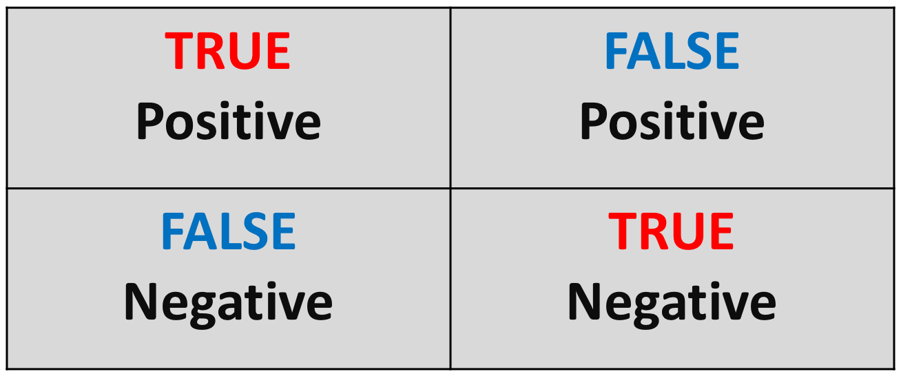

```{r setup, include=FALSE, message = FALSE, warning = FALSE}
knitr::opts_chunk$set(echo = F,
                      include=TRUE,
                      prompt = TRUE,
                      message = FALSE,
                      warning = FALSE,
                      fig.height = 5,
                      fig.width = 7,
                      cache = FALSE)
```

## Logistic Regression

Often in studies, we encounter outcomes that are not continuous, but instead fall into 1 of 2 categories. In these cases we have binary outcomes, variables that can have only two possible values:

- Measuring a performance labeled as $Y$. Candidates are classified as “good” or “poor”, coded as 1 and 0 respectively, i.e. $Y$=1 representing good performance and $Y$=0 representing poor performance.
- Risk factor for cancer: person has cancer ($Y$ = 1), or does not ($Y$ = 0)
- Whether a political candidate is going to win an election: lose $Y$=0, win $Y$=1
- ‘Health’ of a business can be observed by monitoring the solvency of the firm: bankrupt $Y$=0, solvent $Y$=1

Here $Y$ is the binary response variable, that is coded as 0 or 1 and rather than predicting these two values for binary response we try to model the probabilities that $Y$ takes one of these two values.

Let us examine one such example using [the bankruptcies data](https://tanjakec.github.io/mydata/Bankrupticies.csv) available from 👉 <https://tanjakec.github.io/mydata/Bankruptcies.csv>.

[`Bankruptcies.csv`](https://tanjakec.github.io/mydata/Bankruptcies.csv) file contains data of the operating financial ratios of 66 firms which either went bankrupt or remained solvent after a 2 years period. The data is taken from the book ["Regression Analysis by Example"](https://www.wiley.com/en-us/Regression+Analysis+by+Example%2C+5th+Edition-p-9781118456248) by [Chatterjee](http://people.stern.nyu.edu/schatter/chatterjee.html) and [Hadi](http://www1.aucegypt.edu/faculty/hadi/). The variables are:

- three financial ratios (the explanatory variables; measured variables): 
  * $X_1$: Retained Earnings / Total Assets 
  * $X_2$: Earnings Before Interest and Taxes / Total Assets
  * $X_3$: Sales / Total Assets
- a binary response variable $Y$: 
  * 0 - if bankrupt after 2 years
  * 1 - if solvent after 2 years

```{r, echo=TRUE}
bankrup <- read.csv("https://tanjakec.github.io/mydata/Bankruptcies.csv")
summary(bankrup)
```

Since 

1) linear regression expects a numeric response variable and 
2) we are interested in the analysis of the risk, ie. the probability of a firm going bankrupt based on its Retained Earnings / Total Assets ratio (RE/TA ratio) figure 

it would be very attractive to be able to use the same modelling techniques as for linear models. We are going to do just that: fit a simple linear regression model to examine this relationship to see if it will work.

$$Y = b_0 + b_1X_3$$
```{r}
model_lm = lm(Y ~  X1, data = bankrup)
# plot a scatter diagram of Y vs X1
plot(Y ~  X1, data = bankrup, 
     col = "orangered", pch = "|", ylim = c(-0.2, 1.2),
     main = "using linear regression function for binomial Y")
abline(h = 0, lty = 3)
abline(h = 1, lty = 3)
abline(h = 0.5, lty = 2)
abline(model_lm, lwd = 3, col = "navy")
```

Examining this plot we can make two obvious observations:

1) the higher the ration of RE/TA the better the chances is for the firm to be solvent 

2) by analysing the risk we analyse a chance, a probability of a company being solvent based on the value of the RE/TA. Since $Y$ is limited to the values of 0 and 1, rather than predicting these two values we will try to model the probabilities $p$ that $Y$ takes one of these two values.

Let $p$ denote the probability that $Y$ = 1 when $X = x$. If we use the standard linear model to describe $p$, then our model for the probability would be


$$p = P(Y = 1 | X = x) = b_0 + b_1x + e$$

Note that since $p$ is a probability it must lie between 0 and 1. It seems rational that $X\hat{b}$ is a reasonable estimate of $P(Y=1∣X=x)$. Nonetheless, the plot has flagged a big issue with this model and that is that it has predicted probabilities less than 0.  
  
As we can see the linear regression model does not work for this type of problem, for which we do not expect predictions that are off-scale values: below zero or above 1. 

Apart from the fact that the linear function given is unbounded, and hence cannot be used to model probability, the other assumptions of linear regression when dealing with this type of a problem are also not valid: 

- the relationship between $Y$ and $X$ is nonlinear
- error terms are not normally distributed
- the assumption of equal/constant variance (homoscedasticity) dos not hold


A workaround these issues is to fit a different model, one that is bounded by the minimum and maximum probabilities. It makes better sense to model the probabilities on a transformed scale and this is what is done in logistic regression analysis. The relationship between the probability $p$ and $X$ can be presented by a **logistic regression function**.

```{r, echo=FALSE, results='hide', warning = FALSE}
lgreg_plot <- glm(Y ~  X1, data = bankrup, binomial(logit))
summary(lgreg_plot)
range(bankrup$Y)
range(bankrup$X1)
x1re_ta <- seq(-309, 69, 3)
yx1 <- predict(lgreg_plot, list(X1 = x1re_ta), type="response")
```

```{r, echo=FALSE}
plot(Y ~  X1, data = bankrup, 
     col = "orangered", pch = "|", ylim = c(-0.2, 1.2),
     main = "using logistic regression function for binomial Y ")
abline(h = 0, lty = 3)
abline(h = 1, lty = 3)
lines(x1re_ta, yx1, lty = 1, lwd = 3, col = "navy")
```

The shape of the S-curve given in the figure above can be reproduced if we model the probabilities as follows

$$p = P(Y = 1 | X = x) = \frac{e^{\beta_0 + \beta_1x}}{1 + e^{\beta_0 + \beta_1x}},$$

where $e$ is the base of the natural logarithm. The logistic model can be generalized directly to the situation where we have several predictor variables. The probability $p$ is modelled as

$$p = P(Y = 1 | X_1 = x_1, X_2=x_2, ..., X_q=x_q) = \frac{e^{\beta_0 + \beta_1x_1 + \beta_2x_2 + ... + \beta_qx_q}}{1 + e^{\beta_0 + \beta_1x_1 + \beta_2x_2 + ... + \beta_qx_q}},$$
where $q$ is the number of predictors. The two equations above are called the logistic regression functions. It is nonlinear in the parameters $\beta_0, \beta_1,... \beta_q$. However, it can be linearised by the **logit transformation**. Instead of working directly with $p$ we work with a transformed value of $p$. If $p$ is the probability of an event happening, the ratio $\frac{p}{(1-p)}$ is called the **odds ratio** for the event. By moving some terms around

$$1 - p = P(Y = 1 | X_1 = x_1, X_2=x_2, ..., X_q=x_q) = \frac{1}{1 + e^{\beta_0 + \beta_1x_1 + \beta_2x_2 + ... + \beta_qx_q}},$$
we get 

$$\frac{p}{1-p} = e^{\beta_0 + \beta_1x_1 + \beta_2x_2 + ... + \beta_qx_q}$$
Taking the natural logarithm of both sides of the above expression, we obtain

$$g(x_1, x_2, ... x_q) = log(\frac{p}{1-p}) = \beta_0 + \beta_1x_1 + \beta_2x_2 + ... + \beta_qx_q$$
where the logarithm of the odds ratio is called the **logit**. We realise that the logit transformation produces a linear function of the parameters $\beta_0, \beta_1,... \beta_q$. It is important to realise is that while the range of values of $p$ of binomial response $Y$ is between 0 and 1, the range of values of $log\frac{p}{(1-p)}$ is between $-\infty$ and $+\infty$. This makes the logarithm of the odds ratio, known as logits, more appropriate for linear regression fitting.

In logistic regression the response probabilities are modelled by the logistic distribution function. That is, the model does not use the binned version of the predictor, but rather the log odds are modelled as a function of the predictor. The model parameters are estimated by working with logits which produces a model that is linear in the parameters. 

The method of model estimation is the **maximum likelihood** method. Maximum likelihood parameter estimation is a technique that can be used when we can make assumptions about the probability distribution of the data. Based on the theoretical probability distribution and the observed data, the likelihood function is a probability statement that can be made about a particular set of parameter values. In logistic regression modelling the maximum likelihood parameters are obtained numerically using an interactive procedure. This is explained in the [book by McCullagh and Nelder](http://www.utstat.toronto.edu/~brunner/oldclass/2201s11/readings/glmbook.pdf) in Section 4.4.2.  

Although the method of maximum likelihood is used for the model estimation we ask the same set of questions that are usually considered in linear regression. That is, we can not use the very familiar least square regression tools such as $R^2$, $t$ and $F$, but that is not to say that we are not able to answer the same questions as we do when assessing a leaner regression model for which we use the listed tools.

[John Nelder](https://en.wikipedia.org/wiki/John_Nelder) and [Robert Wedderburn](https://en.wikipedia.org/wiki/Robert_Wedderburn_(statistician)) formulated a modelling technique for accommodating response variables with non-normal conditional distribution. Logistic regression and ordinary linear regression fall into this larger class of techniques called [**Generalised Linear Models**](https://docs.ufpr.br/~taconeli/CE225/Artigo.pdf) (**GLM**s) which accommodate many different probability distributions. They substantially extend the range of application of linear statistical models by accommodating response variables with non-normal conditional distribution. Except for the error, the right hand side of a GLM model equation is basically the same as for a linear model. This is reflected in the syntax of the `glm()` function in R, which expects the formula that specifies the right-hand side of GLM to be the same as those used for the least square linear regression model, with the addition of description for the error distribution.

## Example in R

In the following examples we will apply logistic regression in R by directly applying the `glm()` function and by using the `caret` package. We will use two data sets: [`Bankrupticies.csv`](https://tanjakec.github.io/mydata/Bankruptcies.csv) which we introduced earlier and the `CreditCard` data set from the `AER` package. This is cross-section data on the credit history for a sample of applicants for a type of credit card that consists of 1319 observations with 12 variables.   

## Using the `glm()` function

Through this example we will fit a logistic regression model using the `glom` function in order to learn how such models are fitted and evaluated. 

We have already uploaded the [`Bankrupticies.csv`](https://tanjakec.github.io/mydata/Bankruptcies.csv) data file, which contains information of the operating financial ratios of 66 firms which either went bankrupt or remained solvent after a 2 years period earlier. Hence, the response variable is defined as


$Y$: 

  * 0 - if bankrupt after 2 years
  * 1 - if solvent after 2 years
  

Here, we will instead of predicting $Y$, fit the model to predict the logits $log\frac{p}{(1-p)}$, which after transformation means we can get the predicted probabilities for $Y$. 

Let us remind ourselves what the data looks like.

```{r, echo =TRUE}
suppressPackageStartupMessages(library(dplyr))

bankrup <- read.csv("https://tanjakec.github.io/mydata/Bankruptcies.csv")
summary(bankrup)

glimpse(bankrup)
```

Before we start the model fitting procedure we will make test-train split data in the proportion of 80:20.

```{r, echo =TRUE}
set.seed(123)
split_idx = sample(nrow(bankrup), 53)
bankrup_train = bankrup[split_idx, ]
bankrup_test = bankrup[-split_idx, ]
```

We will have a quick glance at data to see what the training data is like
```{r, echo =TRUE}
glimpse(bankrup_train)
summary(as.factor(bankrup_train$Y))
summary(bankrup_train)
```

We have a nice split in terms of number of observations for each class of Y. Next, we estimate a logistic regression model using the `glm()` (generalised linear model) function which we save as an object. 

```{r, warning = FALSE, echo =TRUE}
model <- glm(Y ~ X1 + X2 + X3, data = bankrup_train, family = binomial(logit))
model
```

In order to get all the results saved in the `glm_model` object we use the summary command.

```{r, echo =TRUE}
summary(model)
```

<span style="color:darkgray">
The key components of R’s summary( ) function for generalised linear models for binomial family with the logit link are:

<span style="color:darkgray">
- **Call**: just like in the case of fitting the `lm()` model this is R reminding us what model we ran, what options we specified, etc

<span style="color:darkgray">
- the **Deviance Residuals** are a measure of model fit. This part of the output shows the distribution of the deviance residuals for individual cases used in the model. Below we discuss how to use summaries of the deviance statistic to assess model fit

<span style="color:darkgray">
- the **Coefficients**, their standard errors, the z-statistic (sometimes called a Wald z-statistic), and the associated p-values. The logistic regression coefficients give the change in the log odds of the outcome for a one unit increase in the predictor variable

<span style="color:darkgray">
At the end there are **fit indices**, including the null and deviance residuals and the AIC, which are used to assess overall model fit.

We realise that the output above has a resemblance to the standard regression output. Although they differ in the type of information, they serve similar functions. Let us make an interpretation of it.

The fitted logarithm of the odds ratio, i.e. logit of the probability $p$ of the firm remaining solvent after two years is modelled as:

$$\hat{g}(X_1, X_2, ...X_q) = -9.8846 +  0.3238X_1 + 0.1779X_2 + 4.9443X_3$$
Remember that here instead of predicting $Y$ we obtain the model to predict $log{frac{p}{(1-p)}$. Using the transformation of the logit we get the predicted probabilities of the firm being solvent.

The estimated parameters are expected changes in the logit for unit change in their corresponding variables when the other, remaining variables are held fixed. That is, the logistic regression coefficients give the change in the log odds of the response variable for a unit increase in the explanatory variable:

- For a unit change in X1, the log odds of a firm remaining solvent increases by 0.33, while the other variables, X2 and X3, are held fixed
- For a unit change in X2, the log odds of a firm remaining solvent increases by 0.18, while the other variables, X1 and X3, are held fixed
- For a unit change in X3, the log odds of a firm remaining solvent increases by 5.09, while the other variables, X1 and X2, are held fixed

This is very hard to make sense of. We have predicted log odds and in order to interpret them into a more sensible fashion we need to "anti logge" them as the changes in odds ratio for a unit change in variable $X_i$, while the other variables are held fixed $e^(\beta_i)$.

```{r, echo =TRUE}
round(exp(coef(model)), 4)
```

Now, we can interpret the coefficients of the rations as follows:

- The odds of a firm being solvent (vs being bankrupt) increases by 1.38 for a unit change in ratio $X_1$, all else in the model being being fixed. That is, for an increase in $X_1$ the relative odds of
$$\frac{P(Y=1)}{P(Y=0)}$$

is multiplied by $e^{\beta_1} = e^{0.3238} = 1.38$, implying that there is an increase of $38\%$

- The odd of a firm being solvent (vs being bankrupt) increases by 1.20 for a unit change in ratio $X_2$, all else in the model being being fixed... implying that there is an increase of $20\%$

- The odd of a firm being solvent (vs being bankrupt) increases by 140.37 for a unit change in ratio $X_3$, all else in the model being being fixed... implying that there is an increase of $40.37\%$

The column headed as `z value` is the ratio of the coefficients (`Estimate`) to their standard errors (`Std. Error`) known as **Wald statistics** for testing the hypothesis that the corresponding parameter are zeros. In standard regression this would be the **t-test**. Next to Wald test statistics we have their corresponding $p$-values (`Pr(>|z|)`) which are used to judge the significance of the coefficients. Values smaller than $0.5$ would lead to the conclusion that the coefficient is significantly different from $0$ at $5\%$ significant level. From the output obtained we see that none of the $p$-values is smaller than $0.5$ implying that none of the variables individually is significant for predicting the logit of the observations.

We need to make a proper assessment to check if the variables collectively contribute in explaining the logit. That is, we need to examine whether the coefficients $\beta_1$,  $\beta_2$ and $\beta_3$ are all zeros. We do this using the $G$ statistic, which stands for **goodness of fit**

$$G = \text{likelihood without the predictors}- \text{likelihood with the predictors}$$
$G$ is distributed as a _chi-square_ statistic with 1 degree of freedom, so a _chi-square test_ is the test of the fit of the model (note, that $G$ is similar to an $R^{2}$ type test). The question we have now is where do we get this statistic from?

In addition to the above, the summary of the model includes the deviance and degrees of freedom for a model with only an intercept (the null deviance) and the residual deviance and degrees of freedom for a fitted model. We calculate the $G$ statistic as difference in deviances between the null model and the fitted model

Before we calculate the $G$ statistic we need to specify the hypotheses:

- $H_0: \beta_i = 0$ 
- $H_1: \text{at least one is different from } 0$

where $i = 1, 2, 3$. The decision rule is: 

- If $G_{calc} < G_{crit} \Rightarrow H_0 \text{, o.w. } H_1$

We can also consider: If its associated $p$-value is greater than $0.05$ we conclude that the variables do not collectively influence the logits, if however $p$-value is less that $0.05$ we conclude that they do collectively influence the logits. 

Next we calculate the $G$ statistic and the degrees of freedom of the corresponding critical value. Knowing what it is, we can calculated manually or obtain it using the `pscl::pR2()` function

```{r, warning = FALSE, echo =TRUE}
G_calc <- model$null.deviance - model$deviance
Gdf <- model$df.null - model$df.residual
pscl::pR2(model)
G_calc
qchisq(.95, df = Gdf) 
1 - pchisq(G_calc, Gdf)
```

As $G_{calc}$ = 67.52 > $G_{crit}$ = 7.81 $\Rightarrow H_1$, ie. $p\text{-value}$ = 0.00 < 0.05 we can conclude that this is a statistically valid model and that the variables collectively have explanatory power. The next question we need to ask is do we need all three variables?

In linear regression we assessed the significance of individual regression coefficients, i.e. the contribution of the individual variables using the _t-test_. Here, we use the _z scores_ to conduct the equivalent Wald statistic (test). The ratio of the logistic regression has a normal distribution as opposed to the t-distribution we have seen in linear regression. Nonetheless, the set of hypotheses we wish to test is the same:

- $H_0: \beta_i = 0$    (coefficient $i$ is not significant, thus $X_i$ is not important)
- $H_1: \beta_i \neq 0$    (coefficient $i$ is significant, thus $X_i$ is important)

We are going to use a simplistic approach in testing these hypotheses in terms of the adopted decision rule. Decision Rule: If the Wald's z statistic lies between -2 and +2, then the financial ratio, $X_i$, is not needed and can be dropped from the analysis. Otherwise, we will keep the financial ratio. However, there is some scope here for subjective judgement depending upon how near to +/-2 theWald's $z$ value is. Therefore we may have to do some "manual" searching upon an acceptable set of explanatory variables, as the z value of all three variables in the model lies between +/-2.

In our example none of the variables appear to be important judging upon their Wald's z statstic, yet based on the chi-square statistic $G$, we know that the fitted model is valid and that the selected variables collectively contribute in explaining the logits.

To evaluation individual contribution of the variables used in a logistic regression model we examine what happens to the change in the chi-square statistic $G$ when the $i^{th}$ variable is removed from the model. A large $p$-value means that the reduced model explains about the same amount of variation as the full model and, thus, we can probably leave out the variable.

Decision Rule: if $p$-value > 0.05 $\Rightarrow$ the variable can be taken out, otherwise if $p$-value < 0.05 keep the variable in the model.

Rather then fitting individual models and doing a manual comparison we can make use of  the anova function for comparing the nested model using the chi-square test.

```{r, warning = FALSE, echo =TRUE}
anova(model, test="Chisq")
```

We can remove $X_3$ variable from the model

```{r, warning = FALSE, echo =TRUE}
model_new <- update(model, ~. -X3, data = bankrup)
summary(model_new)
anova(model_new, test="Chisq")
```

To compare the fit of the alternative model we will use the **A**kaike **I**nformation **C**riterion (**AIC**), which is an index of fit that takes account of parsimony of the model by penalising for the number of parameters. It is defined as

$$AIC = - 2 \times \text{maximum log-likelihood} + 2 \times \text{number of parameters}$$
and thus smaller values are indicative of a better fit to the data. In the context of logit fit, the AIC is simply the residual deviance plus twice the number of regression coefficients.   

The AIC of the initial model is 13.787 and of the new model 15.472. Checking the new model, we can see that it consists of the variables that all significantly contribute in explaining the logits. So, in the spirit of parsimony we can choose the second model to be a better fit.

To obtain the overall accuracy rate we need to find the predicted probabilities of the observations kept aside in the `bankrup_test` subset. By default, `predict.glm()` uses `type = "link"` and if not specified otherwise R is returning:

$$\hat{\beta_0} + \hat{\beta_1}X_1 + \hat{\beta_2}X_2$$
for each observation, which are not predicted probabilities. To obtain the predicted probabilities:

$$\frac{1}{1 + e^{\hat{\beta_0} + \hat{\beta}_1x_1 + \hat{\beta}_2x_2}}$$
when using the `predict.glm()` function we need to use `type = "response"`.

```{r, echo =TRUE}
link_pr <- round(predict(model_new,  bankrup_test, type = "link"), 2)
link_pr

response_pr <- round(predict(model_new,  bankrup_test, type = "response"), 2)

t(bankrup_test$Y)

coefficients(model_new)
```

Here we illustrate how these predictions are made for the third and twelfth observations in the `bankrup_test` data subset.

```{r, echo =TRUE}
bankrup_test[c(3, 12),]

round(1/(1+exp(-(-0.5503398 + 0.1573639*(-18.1) + 0.1947428*(-6.5)))), 4)
round(1/(1+exp(-(-0.5503398 + 0.1573639*54.7 + 0.1947428*14.6))), 4)
```

Knowing how the probabilities are estimated for the test data we now need to describe the performance of a classification model. 

## Accuracy

A common method for describing the performance of a classification model is the **_confusion matrix_**. So, to check how well the model has performed we will construct the confusion matrix, which is a table that is used to show the number of correct and incorrect predictions on a classification problem when the real values of the *test data* are known. For a two class problem it is of the format

```{r confusion_matrix, out.width = "500px",  fig.align = 'center', echo=FALSE}

```

The `TRUE` values are the number of correct predictions made. The values on the diagonal shows the number of correctly classified instances for each category.

```{r, echo =TRUE}
how_well <- data.frame(response_pr, bankrup_test$Y) %>% 
  mutate(result = round(response_pr) == bankrup_test$Y)

how_well

confusion_matrix <- table(bankrup_test$Y, round(response_pr))
confusion_matrix
```

The simplest metric for model classification is the overall **_accuracy rate_**. To evaluate predicted classes, we are going to create a function that can calculate the accuracy of the fitted model.

```{r, echo =TRUE}
# calculate percentage accuracy
accuracy <- function(x){
  sum(diag(x) / (sum(rowSums(x)))) * 100
}
```

Knowing how the probabilities are estimated for the test data we can now describe the performance of a classification model using the confusion matrix.

```{r, echo =TRUE}
accuracy(confusion_matrix)
```

Although the overall accuracy rate might be easy to compute and to interpret, it makes no distinction about the type of errors being made. 

## **YOUR TURN** 👇

Practise by doing the following exercises:

Access the `stroke` data set from <https://tanjakec.github.io/mydata/stroke.csv>. Data dictionary of this data set is given in <https://tanjakec.github.io/mydata/Stroke_DataDictionary.docx> word document.

i. Split the data into a training and a test set. Fit a logistig regression model using the training part of the data set.

ii. Predict the response for the test set.

iii. What is the value of the performance metric?


-----------------------------
[Creative Commons Attribution-ShareAlike 4.0 International License.](https://creativecommons.org/licenses/by-sa/4.0/)


